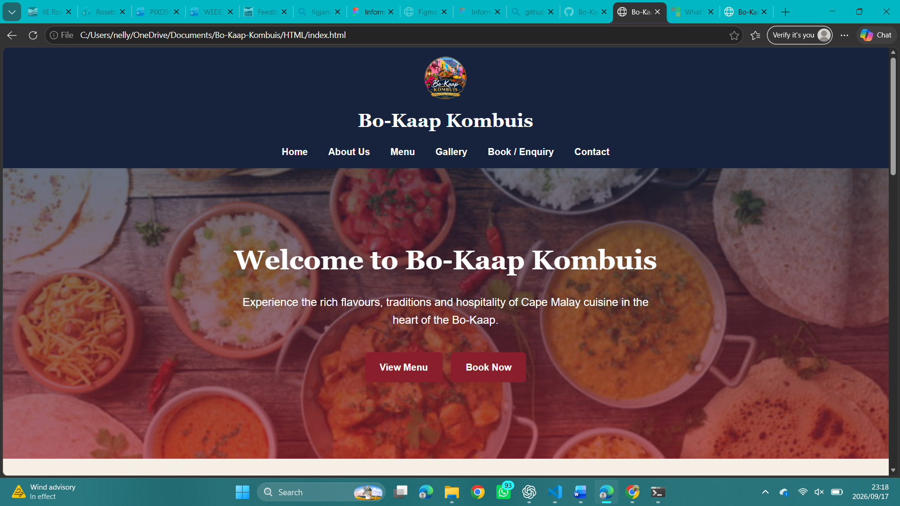
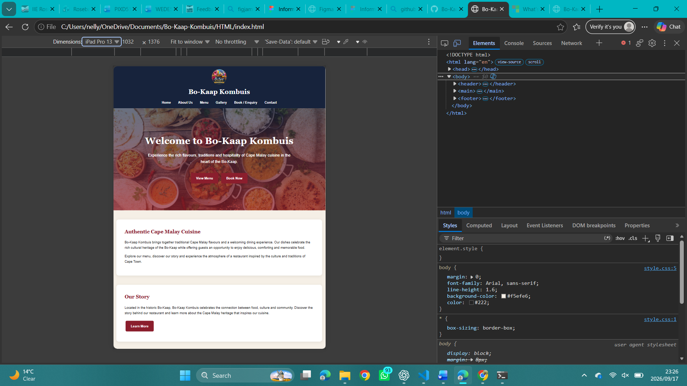
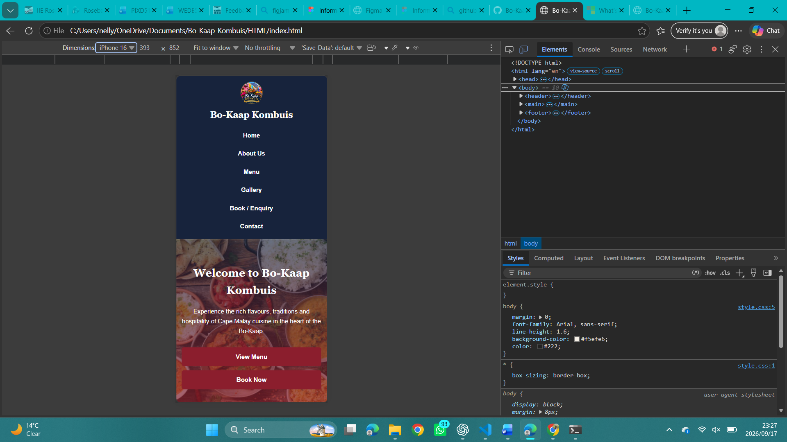

````markdown
# **Bo-Kaap Kombuis**

## **Student Information**

**Student Number:** ST10533474

**Student Name:** Nelly Mgijima

**Project:** Bo-Kaap Kombuis Website

**Course:** Web Development

**Project Type:** Restaurant Website

**Development Tools:** Visual Studio Code, Git and GitHub

---

## **Project Overview**

Bo-Kaap Kombuis is a restaurant website project designed to showcase Cape Malay cuisine and the cultural heritage of the Bo-Kaap. The website provides visitors with information about the restaurant, its menu, food, cultural atmosphere, booking options and contact details.

The website was developed as a multi-page website using HTML5, CSS3 and JavaScript. The project also uses Git and GitHub for version control and project submission.

---

## **Website Purpose**

The purpose of the website is to provide Bo-Kaap Kombuis with an informative, attractive and user-friendly online presence.

The website allows visitors to:

- Learn about Bo-Kaap Kombuis and its cultural background.
- View information about Cape Malay cuisine and menu options.
- Explore photographs of food and the restaurant.
- Submit a booking or enquiry.
- Find the restaurant's contact information.
- Navigate between the different sections of the website easily.

---

## **Goals and Objectives**

### **Goals**

The main goal of the project is to create a professional restaurant website that communicates the identity of Bo-Kaap Kombuis while providing visitors with useful information and simple navigation.

The website aims to:

- Present Bo-Kaap Kombuis in a professional and visually appealing way.
- Highlight Cape Malay food and the cultural heritage of the Bo-Kaap.
- Provide visitors with clear information about the restaurant.
- Make important information such as the menu, booking and contact details easy to find.
- Provide a responsive website that can be viewed on desktop, tablet and mobile devices.

### **Objectives**

The project objectives are to:

1. Develop a multi-page website using HTML5.
2. Create a consistent visual design using an external CSS stylesheet.
3. Use CSS Grid and Flexbox to create structured page layouts.
4. Apply appropriate typography, colours, spacing and visual styling.
5. Add interactive elements using JavaScript.
6. Create a functional booking/enquiry form with a confirmation message.
7. Implement responsive design for different screen sizes.
8. Organise images and project files into appropriate folders.
9. Use Git and GitHub for version control.
10. Maintain a detailed README and changelog documenting the development process.

---

## **Website Pages**

The website consists of the following pages:

### **Home**

Introduces Bo-Kaap Kombuis and highlights the restaurant experience, Cape Malay cuisine and links to other sections of the website.

### **About Us**

Provides information about the restaurant, its cultural connection to the Bo-Kaap and its Cape Malay heritage.

### **Menu**

Displays information about the Cape Malay food and menu options available at the restaurant.

### **Gallery**

Showcases food, restaurant and cultural images to provide visitors with a visual representation of the restaurant experience.

### **Booking**

Allows visitors to submit a booking or general enquiry through an online form.

### **Contact**

Provides visitors with relevant contact information for the restaurant.

---

## **Technologies Used**

The website was developed using the following technologies:

### **HTML5**

HTML5 is used to create the structure and content of the six website pages.

### **CSS3**

CSS3 is used for:

- Page styling
- Colours
- Typography
- Spacing
- Layout
- Navigation styling
- Responsive design
- Interactive visual effects

### **JavaScript**

JavaScript is used to provide interactive functionality, including the booking/enquiry confirmation message.

### **Git**

Git is used for local version control and to keep track of changes made during development.

### **GitHub**

GitHub is used to store the project repository remotely and provide version control for the project.

---

## **Project Structure**

```text
Bo-Kaap-Kombuis/
│
├── HTML/
│   ├── index.html
│   ├── about.html
│   ├── menu.html
│   ├── gallery.html
│   ├── booking.html
│   └── contact.html
│
├── CSS/
│   └── style.css
│
├── JS/
│   └── script.js
│
├── Images/
│   ├── food/
│   ├── gallery/
│   │   ├── gallery1.jpg
│   │   ├── gallery1-small.png
│   │   ├── gallery1-medium.png
│   │   ├── gallery1-large.png
│   │   ├── gallery2.jpg
│   │   ├── gallery2-small.png
│   │   ├── gallery2-medium.png
│   │   ├── gallery2-large.png
│   │   ├── gallery3.jpg
│   │   ├── gallery3-small.png
│   │   ├── gallery3-medium.png
│   │   └── gallery3-large.png
│   ├── logo/
│   └── restuarant/
│
├── Screenshots/
│   ├── desktop.png
│   ├── tablet.png
│   └── mobile.png
│
└── README.md
````

---

## **Changelog**

### **Part 2 – CSS Styling and Responsive Design**

* Improved the overall website styling using an external CSS stylesheet.
* Updated the homepage hero section with a Cape Malay food image and improved text readability.
* Improved the navigation layout, spacing and hover effects.
* Added responsive navigation for smaller screen sizes.
* Improved button styling and interactive hover effects.
* Added focus styling for form fields and navigation links.
* Improved the layout and appearance of content sections using spacing, borders and shadows.
* Improved the gallery layout with responsive grid columns.
* Added responsive image sizing for different screen sizes.
* Improved booking and contact form styling.
* Added mobile and tablet breakpoints to improve usability on smaller screen sizes.
* Tested the website across desktop, tablet and mobile screen sizes using browser developer tools.
* Added desktop, tablet and mobile screenshot evidence to document responsive testing.

---

## **Responsive Design Evidence**

The website was tested at desktop, tablet and mobile screen sizes using browser developer tools. The layout, navigation, images, text and content were checked to ensure that the website remains readable and usable across different screen sizes.

### **Desktop View**



### **Tablet View**



### **Mobile View**



---

## **References**

Mozilla Developer Network (MDN) (2026) *Responsive web design*. Available at: https://developer.mozilla.org/en-US/docs/Learn_web_development/Core/CSS_layout/Responsive_Design (Accessed: 17 September 2026).

Mozilla Developer Network (MDN) (2026) *Using responsive images in HTML*. Available at: https://developer.mozilla.org/en-US/docs/Web/HTML/Guides/Responsive_images (Accessed: 17 September 2026).

Mozilla Developer Network (MDN) (2026) *Media query fundamentals*. Available at: https://developer.mozilla.org/en-US/docs/Learn_web_development/Core/CSS_layout/Media_queries (Accessed: 17 September 2026).

Mozilla Developer Network (MDN) (2026) *CSS flexible box layout*. Available at: https://developer.mozilla.org/en-US/docs/Web/CSS/Guides/Flexible_box_layout (Accessed: 17 September 2026).

